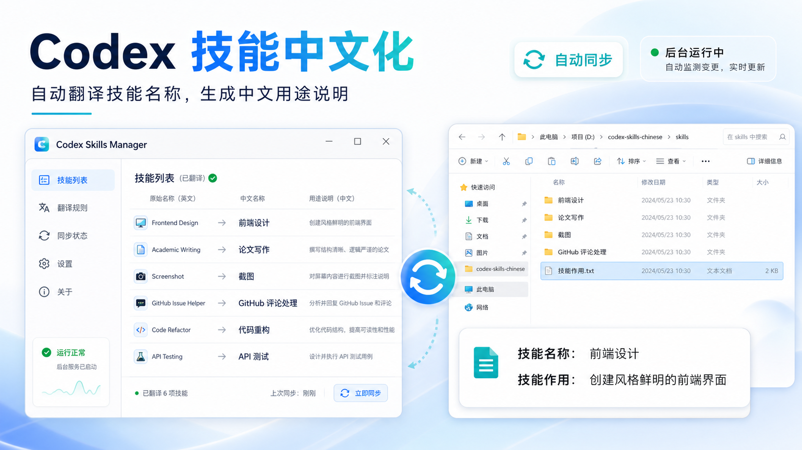
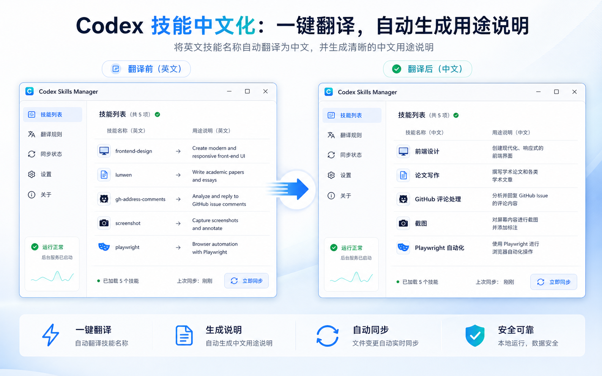
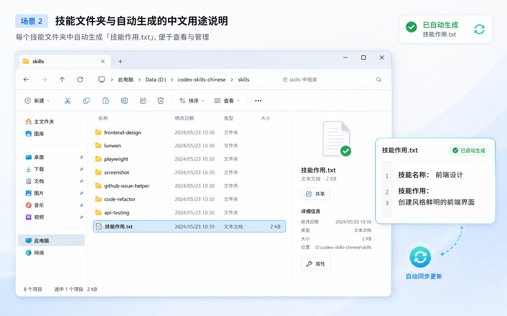
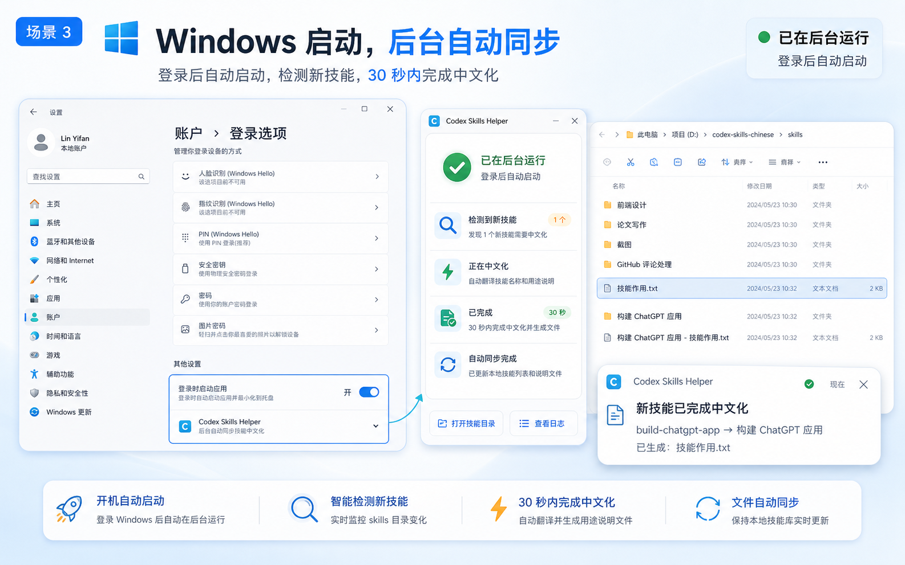

<div align="center">
  
  <h1>Codex Skills Chinese</h1>
  <p>让 Codex 技能列表更适合中国用户：自动中文化技能名称、技能说明，并为每个技能文件夹生成 <code>技能作用.txt</code>。</p>
  <p>
    
    
    
    
  </p>
</div>

## 项目简介

`codex-skills-chinese` 是一个面向中文用户的 Codex 技能中文化工具。

它会自动扫描 `~/.codex/skills` 和 `~/.codex/plugins`，把技能列表里原本不直观的英文名称和英文说明改成更容易理解的中文内容，同时在每个技能文件夹里自动生成一份 `技能作用.txt`，方便你在资源管理器里直接看懂每个技能是做什么的。

如果你后续又安装了新技能，这个项目也会继续自动处理，不需要每次手动修改。

## 你能得到什么

- 技能列表更直观：把英文技能名改成更自然的中文显示名
- 技能说明更易懂：自动补充中文短描述
- 文件夹可直接查看：为每个技能目录自动生成 `技能作用.txt`
- 新增技能自动同步：新装技能后大约 30 秒内自动处理
- 重启后依然生效：支持 Windows 登录后自动后台运行
- 支持手动覆盖：你可以自定义某些技能的中文名和说明

## 效果展示


### 1. 技能列表从英文变成中文



| 原始英文 | 中文显示 |
| --- | --- |
| `frontend-design` | `前端设计` |
| `lunwen` | `论文写作` |
| `gh-address-comments` | `GitHub 评论处理` |
| `screenshot` | `截图` |
| `playwright` | `Playwright 自动化` |

### 2. 每个技能文件夹自动生成说明文件



```txt
技能名称：前端设计
技能作用：创建风格鲜明的前端界面
```

```txt
技能名称：论文写作
技能作用：撰写和整理中文毕业论文与技术报告
```

### 3. 更适合中国用户的使用方式



- 不用反复猜英文技能名称的意思
- 不用一个个打开 `SKILL.md` 才知道用途
- 不用每次装完技能后自己手改中文
- 对新手更友好，对团队共享环境也更方便

## 适合谁

- 想把 Codex 技能环境改成中文的人
- 看不懂或不习惯英文技能名称的人
- 想把 Codex 配置整理给同学、同事、客户使用的人
- 希望新增技能后也能自动保持中文化的人

## 安装方式

### 方式一：双击安装

下载仓库后，直接双击：

`install.cmd`

### 方式二：PowerShell 安装

在仓库目录打开 PowerShell，运行：

```powershell
powershell -ExecutionPolicy Bypass -File .\install.ps1
```

安装完成后会自动：

- 复制脚本到你的 `C:\Users\你的用户名\.codex\tools\skill-chinese`
- 执行一次全量同步
- 注册 Windows 登录后的后台自动启动

## 安装后怎么用

### 立即手动同步

双击：

`C:\Users\你的用户名\.codex\tools\skill-chinese\立即同步技能中文.cmd`

### 命令行运行

```powershell
python .\sync_skill_chinese.py --once --verbose
```

### 自动后台同步

安装完成后，脚本会在 Windows 登录后自动后台运行。

当你新增技能或插件技能时，它会自动检测并进行中文化处理。

## 自定义中文名称

如果你想把某个技能改成你更习惯的叫法，可以编辑：

`skill_chinese_overrides.json`

示例：

```json
{
  "skills": {
    "browser": {
      "display_name": "浏览器控制",
      "short_description": "控制 Codex 内置浏览器并测试页面"
    }
  }
}
```

修改后重新运行同步即可生效。

## 项目结构

- `sync_skill_chinese.py`：主同步脚本
- `install.ps1`：安装到用户 `.codex` 目录
- `install.cmd`：双击即可安装
- `install_skill_chinese_autorun.ps1`：配置自动后台运行
- `skill_chinese_overrides.json`：中文规则覆盖表
- `立即同步技能中文.cmd`：手动立即同步入口
- `assets/cover.png`：项目封面图

## 常见问题

### 重启电脑后还会生效吗？

会。安装后会配置成 Windows 登录后自动后台运行。

### 新增技能多久会自动处理？

默认大约 30 秒内会自动检测并同步。

### 如果某个翻译我不喜欢怎么办？

直接修改 `skill_chinese_overrides.json`，然后重新运行一次同步即可。

### 这个项目会修改英文触发名吗？

不会。它只改用户界面里显示的中文名称和说明，不会破坏技能的原始调用标识。

## GitHub 首页简介建议

可以把仓库简介设置为这句：

> 让 Codex 技能列表秒变中文，自动生成 技能作用.txt，并支持 Windows 登录后自动后台同步。

更短一点的版本也可以直接用这句：

> Codex 技能中文化工具，自动生成技能用途说明并持续同步新增技能。

## License

MIT

## English Summary

Automatically localize Codex skills into Chinese and generate a `技能作用.txt` note inside each skill folder for easier daily use.
